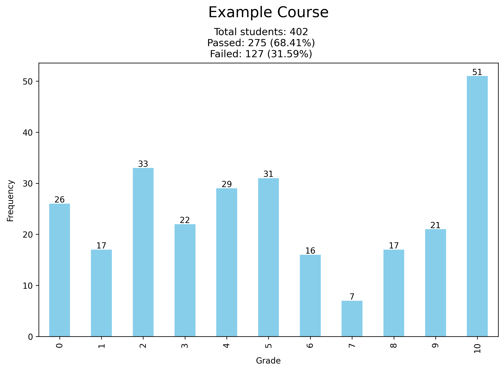

# Grade Extractor

This Python script allows users to extract and analyze grade distributions from a file (PDF, SVG, or Excel). It performs the following tasks:

	Reads the file and extracts a table.
	Displays the extracted table.
	Prompts the user to select the column containing grades.
	Calculates the number and percentage of students who passed the course.
	Generates a frequency plot of the grades with a user-defined title.

## Requirements

1. **Create a Virtual Environment**
```bash
python -m venv venv  

#Activate the virtual environment on Windows:
venv\Scripts\activate  

#On macOS/Linux:
source venv/bin/activate  
```
2. **Install Dependencies**
```bash
#Once the virtual environment is activated, install the required dependencies:
pip install -r requirements.txt
```

## Usage
Run the script with: 
```bash
python GradeExtractor.py
```
You can also use the following command line arguments: 
```bash
python GradeExtractor.py --file <path/to/your/file> --title <title/for/your/file> --output <path/to/output/file> --lang <preferred/lang> --rows <number/of/rows> --thresshold <minimum/grade>
```
### Command-Line Arguments
| Argument   | Description |
|------------|-------------|
| `--file`   | Path to the input file (PDF, CSV, or Excel).|
| `--title`  | Custom title for the grade distribution plot. |
| `--output` | Path to save the output plot (default: `plot.png`). |
| `--lang`   | Language code for localization (default: `en`). |
| `--thresshold`| Minimum grade required to consider a student as "passing". |
| `--rows`   | Number of rows from the table to display before prompting for column selection. |

## Example Plot
